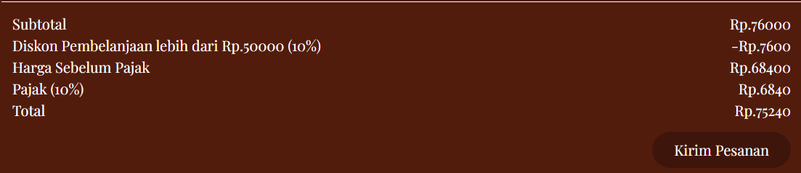
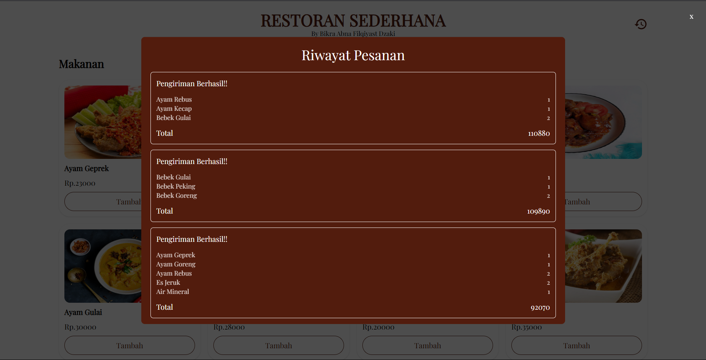

# Sistem Pemesanan Restoran - React & Express

Sebuah aplikasi full-stack untuk manajemen pemesanan restoran

---

## Teknologi yang Digunakan

- React.js (frontend)
- Express.js (backend)

---

## Struktur Folder

Sistem-Pemesanan-Restoran-React-Express/ \
 ├── backend/          # Aplikasi React (Frontend) \
 ├── frontend/          # Aplikasi Express (Backend) \
 ├── Readme.md/          # Dokumentasi Aplikasi 

## Instalasi

### 1. Clone Repository

```bash
git clone https://github.com/bikraabn1/Sistem-Pemesanan-Restoran-React-Express
```

---

### 2. Install Dependensi Express.js

```bash
cd backend
npm install
```

---

### 3. Jalankan Express.js

```bash
npm run dev
```

Aplikasi akan berjalan di port 3000

---

### 4. Install Dependensi React.js

Buka Folder Frontend dengan terminal yang berbeda

```bash
cd frontend
npm install
```

---

### 5. Jalankan React.js

```bash
npm run dev
```

Aplikasi akan berjalan di port 5173

---

## Fitur

### Backend
<b>1. Menampilkan Menu Restoran<b>
 `GET` → `http://localhost:3000/menus`

payload response yang di dapat :

```json
    {
        "food": [
            {
                "id": 1,
                "name": "Ayam Geprek",
                "price": 23000,
                "imageurl": "https://www.dapurkobe.co.id/wp-content/uploads/kulit-ayam-crispy-geprek.jpg"
            },
            {
                "id": 2,
                "name": "Ayam Goreng",
                "price": 19000,
                "imageurl": "https://assets.unileversolutions.com/v1/129343159.png"
            },
        ],
        "drink" : [
            {
                "id": 11,
                "name": "Es Teh Manis",
                "price": 5000,
                "imageurl": "https://encrypted-tbn0.gstatic.com/images?q=tbn:ANd9GcQCjc_4FBea-ScTF3Te5IoMIcjPpdpEFOJwdw&s"
            },
            {
                "id": 12,
                "name": "Es Jeruk",
                "price": 7000,
                "imageurl": "https://doktersehat.com/wp-content/uploads/2018/09/jus-jeruk.jpg"
            },
        ]
    }
```

<b>2. Post Menu yang di pesan oleh client<b>
 `POST` → `http://localhost:3000/orders`

menerima payload post item sebagai berikut

```json
    {
         "items" : [
                          {
                              "id": 1,
                              "name": "Ayam Geprek",
                              "price": 23000,
                              "imageurl": "https://www.dapurkobe.co.id/wp-content/uploads/kulit-ayam-crispy-geprek.jpg",
                              "quantity": 2
                          },
                          {
                              "id": 12,
                              "name": "Es Jeruk",
                              "price": 7000,
                              "imageurl": "https://doktersehat.com/wp-content/uploads/2018/09/jus-jeruk.jpg",
                              "quantity": 1
                          }
                    ]
    }
```

dan akan mendapat response sebagai berikut 

```json
    {
          "message": "Pengiriman Berhasil!!",
          "order": [
              {
                  "id": 1,
                  "name": "Ayam Geprek",
                  "price": 23000,
                  "imageurl": "https://www.dapurkobe.co.id/wp-content/uploads/kulit-ayam-crispy-geprek.jpg",
                  "quantity": 2
              },
              {
                  "id": 12,
                  "name": "Es Jeruk",
                  "price": 7000,
                  "imageurl": "https://doktersehat.com/wp-content/uploads/2018/09/jus-jeruk.jpg",
                  "quantity": 1
              }
          ],
          "subTotal": 53000,
          "discount": 5300,
          "total": 47700,
          "tax": 4770,
          "totalAfterTax": 52470
    }
```


### Frontend
#### <b>1. Menampilkan Menu Restoran<b>

Tampilan ketika menu ditambahkan

#### <b>2. Menampilkan Pop Up Daftar Pesanan yang di pesan<b>

#### <b>3. Tombol untuk Mengurangi atau menambah jumlah tiap item pesanan yang akan di pesan di dalam popup<b>

#### <b>4. Menampilkan Daftar Harga yang berisi :<b>
* Harga Subtotal
* Jumlah diskon yang di dapat apa bila total harga lebih dari 50000(10%)
* Jumlah pajak yang di tambahkan(10%)
* Total harga setelah diskon dan pajak.

#### <b>5.Tombol Kirim Pesanan untuk mendapatkan Nota Pembayaran/Invoice<b>

#### <b>6. Menampilkan Nota Pembayaran yang bisa di unduh sebagai PDF<b>

Hasil Download

#### <b>7. Menampilkan Riwayat Pemesanan dengan menekan tombol riwayat di bagian kanan atas<b>

